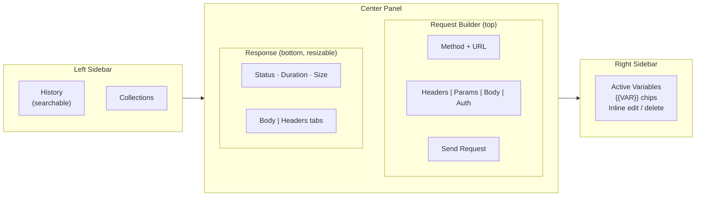

# API Playground

A lightweight Postman-style HTTP client — runs as a native macOS desktop app or directly from the terminal. All requests are proxied through a local Go server (no CORS issues). Supports collections, variables, auth profiles, and curl import.

---

## Requirements

| Requirement | Why |
|---|---|
| [Go 1.21+](https://go.dev/dl/) | Builds the server |
| Xcode Command Line Tools | Required for the native macOS window (`webview`) and CGO screen sizing |

**Install Go:** https://go.dev/dl/

**Install Xcode CLT** (if not already):
```bash
xcode-select --install
```

Check both are present:
```bash
go version        # should print go1.21 or later
xcode-select -p   # should print a path like /Library/Developer/CommandLineTools
```

---

## Option A — Native desktop app (recommended)

Builds a double-clickable **`API Playground.app`** that opens its own window — no browser, no terminal needed.

```bash
# 1. Clone / enter the project
cd api-playground

# 2. Download Go dependencies
go mod download

# 3. Build the .app bundle
chmod +x build-app.sh
./build-app.sh

# 4. Install (drag to Applications or copy)
cp -r "API Playground.app" /Applications/
```

Then open **API Playground** from Finder or Spotlight like any other app.

> **First launch note:** macOS may show a security prompt because the binary is not Apple-signed.
> Right-click → **Open** → **Open** to allow it once.

**Rebuilding after code changes:**
```bash
./build-app.sh
cp -r "API Playground.app" /Applications/
```

Your data (history, variables, collections) is stored separately in:
```
~/Library/Application Support/APIPlayground/
```
It is **not** inside the `.app`, so reinstalling or updating the app never wipes your data.

---

## Option B — Run from terminal

```bash
# 1. Enter the project directory
cd api-playground

# 2. Download Go dependencies
go mod download

# 3. Run (opens a native window automatically)
go run .
```

Or build a standalone binary first:
```bash
CGO_ENABLED=1 go build -o api-playground .
./api-playground
```

The binary must be run from the project root directory — templates are loaded relative to the working directory.

---

## Layout

The workspace is split into three columns:



- **Request and response are stacked vertically** (Postman-style) — both visible at once without scrolling. Drag the divider to resize.
- **Right panel** always shows your active variables (global + current collection) for quick reference and insertion.

---

## Features

| Feature | Details |
|---|---|
| **HTTP client** | GET / POST / PUT / DELETE / PATCH with URL, query params, headers, and body |
| **Body types** | JSON, XML, Form URL-encoded, plain text — auto-sets `Content-Type` |
| **curl import** | Paste a `curl` command into the URL bar or the Import modal — the form fills automatically |
| **Raw HTTP import** | Paste a raw HTTP request (from DevTools, Charles, Wireshark) into the Import modal |
| **curl export** | Generate a `curl` command from the current form via the `</> curl` button |
| **Variables** | Define `{{VAR}}` placeholders; expanded server-side in URL, headers, params, and body |
| **Autocomplete** | Type `{{` in any field to get a live picker of your defined variables |
| **Collections** | Group saved requests in named folders; each collection has its own variables and default auth |
| **History** | Every request auto-saves (last 100); searchable, replayable, deletable, export/import as JSON |
| **Auth profiles** | Token API: call a login endpoint, cache the token, auto-refresh on 401 |
| **No CORS** | The Go server proxies all outbound requests — no browser origin restrictions |

---

## Variables

### Defining variables

Click **+ Add** in the right sidebar or open the variables modal to add global variables.

- Type a **Name** (letters, digits, underscores — cannot start with a digit) and a **Value**, then click **Add**
- **Click the value** of any existing variable to edit it inline — saves automatically on Enter or blur
- **Click a `{{NAME}}` chip** to copy the token to your clipboard
- **Delete** button appears on hover (trash icon)

### Using variables

Both syntaxes work anywhere (URL, headers, params, body):

```
{{BASE_URL}}     canonical double-brace syntax
{BASE_URL}       single-brace also works (convenience)
```

Examples:
```
URL:    https://{{BASE_URL}}/api/users
Header: Authorization: Bearer {{TOKEN}}
Body:   {"org": "{{ORG_ID}}"}
```

Expansion happens **server-side** before the request fires. The URL bar shows a live client-side preview while you type.

### Inserting variables quickly

Three ways to insert a variable into any field:

1. **Quickbar chips** — a row of `{{VAR}}` buttons appears below the URL input once any variables are defined; click one to insert at the cursor
2. **Autocomplete** — type `{{` in the URL, a header value, param value, or body to get a live dropdown picker; navigate with up/down arrows, select with Enter or Tab, dismiss with Esc
3. **Right sidebar** — click any `{{VAR}}` chip to copy the token, then paste it where you need it

### Variable precedence

**Collection variables override global ones** when a collection request is loaded. The right sidebar labels collection-only vars with a grey `coll` badge.

| Scope | Where set | Priority |
|---|---|---|
| Global | Variables panel / right sidebar | Base |
| Collection | Collection Settings | Overrides global |

### Unresolved variables

If a placeholder is not expanded (the variable is not defined or the name is misspelled), the server returns a clear error message explaining which placeholder is missing, rather than a cryptic network error.

---

## Collections

Click **Collections** in the left sidebar to manage collections.

- **Create** — type a name in the input at the top and press **+**
- **Save a request** — click **Save** in the toolbar above the request form
- **Load a request** — expand a collection and click any saved request
- **Collection settings** — set the collection name, default auth profile, and collection-scoped variables
- **Delete a request** — hover over it and click **x**

---

## Auth Profiles

Click **Auth** in the navbar to manage auth profiles.

The only profile type is **Token API** — for APIs that require calling a login endpoint first:

| Field | Example |
|---|---|
| Login URL | `https://api.example.com/auth/login` |
| Body | `{"username": "alice", "password": "secret"}` |
| Body Type | JSON or Form URL-encoded |
| Token path | `access_token` or `data.token` or `result.auth.jwt` |
| Expiry path | `expires_in` (seconds, optional) |
| Inject as | `Authorization: Bearer <token>` (configurable) |

For simple cases (static bearer tokens, API keys), use **Variables** instead — define a `TOKEN` variable and add `Authorization: Bearer {{TOKEN}}` as a header.

Hit **Test Login** before saving to verify the config fires correctly.
Tokens are cached and **auto-refreshed** when close to expiry or when a 401 is received.

---

## Project layout

```
api-playground/
├── main.go              # native window (webview) + server setup
├── handlers.go          # POST /send — proxies requests, injects auth, expands variables
├── auth.go              # auth profile CRUD, token injection, Token API flow
├── history.go           # history persistence, export/import, delete
├── collections.go       # collections + collection variables CRUD
├── variables.go         # global variables, {{VAR}} / {VAR} expansion
├── curl_parser.go       # curl and raw HTTP import parsers
├── environments.go      # environments system (dormant — kept for reference)
├── screen_darwin.go     # CGO CoreGraphics screen sizing
├── build-app.sh         # builds "API Playground.app" for macOS
├── go.mod / go.sum
├── templates/
│   ├── index.html             # shell: layout, sidebar, modals, all JS
│   ├── form.html              # request builder
│   ├── response.html          # response panel
│   ├── history.html           # history sidebar entries
│   ├── collections_panel.html # collections sidebar
│   ├── collection_settings.html
│   ├── collection_options.html
│   ├── variables.html
│   ├── auth_profiles.html
│   └── auth_options.html
└── docs/
    ├── ARCHITECTURE.md  # component map, startup sequence, data models
    ├── FLOW.md          # data flow diagrams for every major action
    ├── DESIGN.md        # design decisions and trade-off rationale
    └── SECURITY.md      # threat model and security guidance
```

---

## API routes

| Method | Path | Description |
|---|---|---|
| `GET` | `/` | Main UI |
| `POST` | `/send` | Proxy + fire the HTTP request |
| `POST` | `/parse-curl` | Parse a curl command into form fields |
| `POST` | `/parse-raw-http` | Parse a raw HTTP request |
| `GET` | `/history-panel` | History sidebar HTML |
| `GET` | `/history/export` | Download history as JSON |
| `GET` | `/history/:id` | Load a history entry into the form |
| `DELETE` | `/history/:id` | Delete a history entry |
| `POST` | `/history/import` | Import history from a JSON file |
| `GET` | `/auth-profiles` | Auth profiles modal HTML |
| `GET` | `/auth-profiles/options` | `<option>` elements for auth select |
| `POST` | `/auth-profiles/test-login` | Test a Token API config |
| `POST` | `/auth-profiles` | Create an auth profile |
| `DELETE` | `/auth-profiles/:id` | Delete an auth profile |
| `GET` | `/variables/map` | Merged variable map as JSON (global + collection) |
| `GET` | `/variables/list` | Global variable list as JSON (with IDs) |
| `GET` | `/variables` | Variables modal HTML |
| `POST` | `/variables` | Create a global variable |
| `PATCH` | `/variables/:id` | Update a variable's value inline |
| `DELETE` | `/variables/:id` | Delete a global variable |
| `GET` | `/collections-panel` | Collections sidebar HTML |
| `GET` | `/collections/options` | `<option>` elements for collection select |
| `POST` | `/collections/save-request` | Save a request into a collection |
| `POST` | `/collections` | Create a collection |
| `DELETE` | `/collections/:id` | Delete a collection |
| `GET` | `/collections/:id/settings` | Collection settings modal HTML |
| `POST` | `/collections/:id/settings` | Update collection settings |
| `GET` | `/collections/:id/variables` | Collection variable list as JSON |
| `POST` | `/collections/:id/variables` | Add a collection variable |
| `PATCH` | `/collections/:id/variables/:var_id` | Update a collection variable inline |
| `DELETE` | `/collections/:id/variables/:var_id` | Delete a collection variable |
| `GET` | `/collections/:id/requests/:req_id` | Load a collection request into the form |
| `DELETE` | `/collections/:id/requests/:req_id` | Delete a saved request |

---

## Data files

All files are created automatically on first use.

| File | Contents |
|---|---|
| `history.json` | Last 100 requests |
| `auth_profiles.json` | Saved auth profiles + cached tokens |
| `variables.json` | Global variables |
| `collections.json` | Collections, their requests, and their variables |

When running as a `.app`, these live in `~/Library/Application Support/APIPlayground/`.
When running from the terminal, they are created in the current working directory.

**Reset everything:**
```bash
rm history.json auth_profiles.json variables.json collections.json
```
