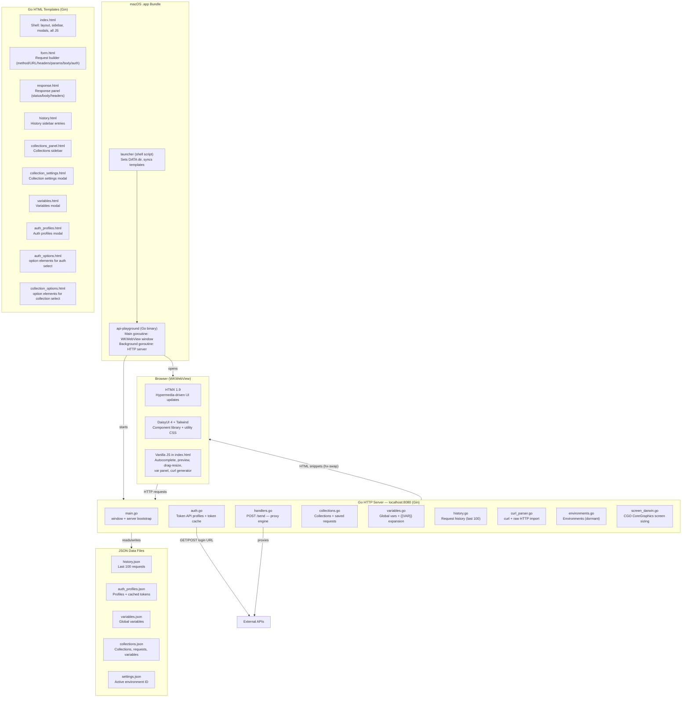
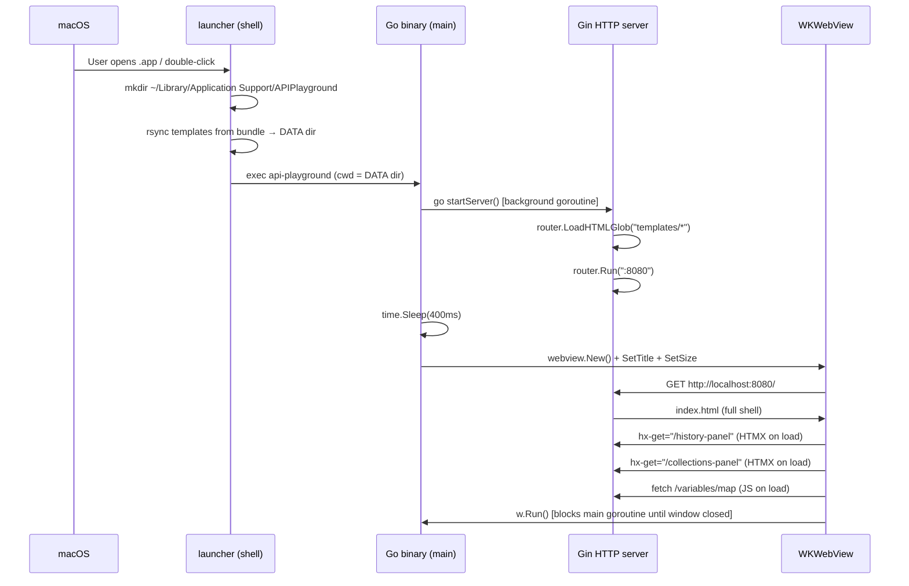
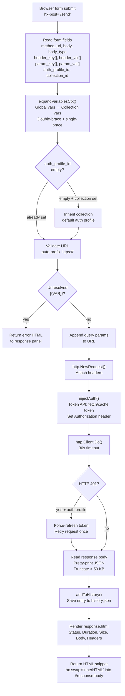
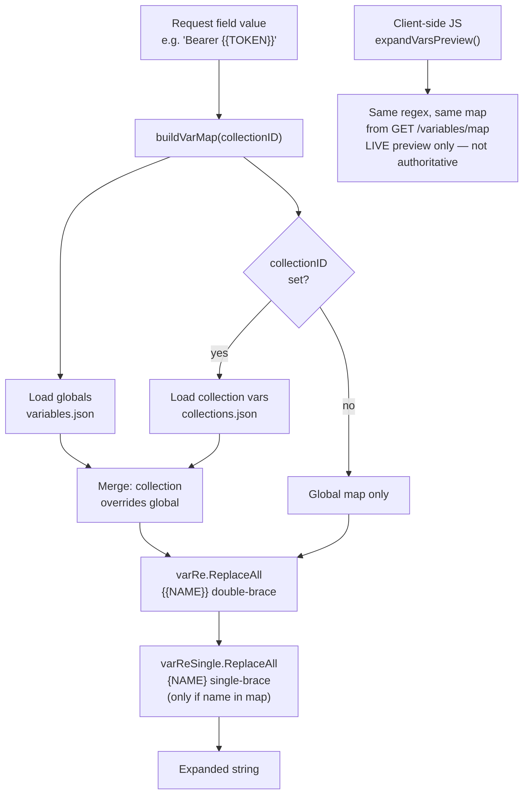
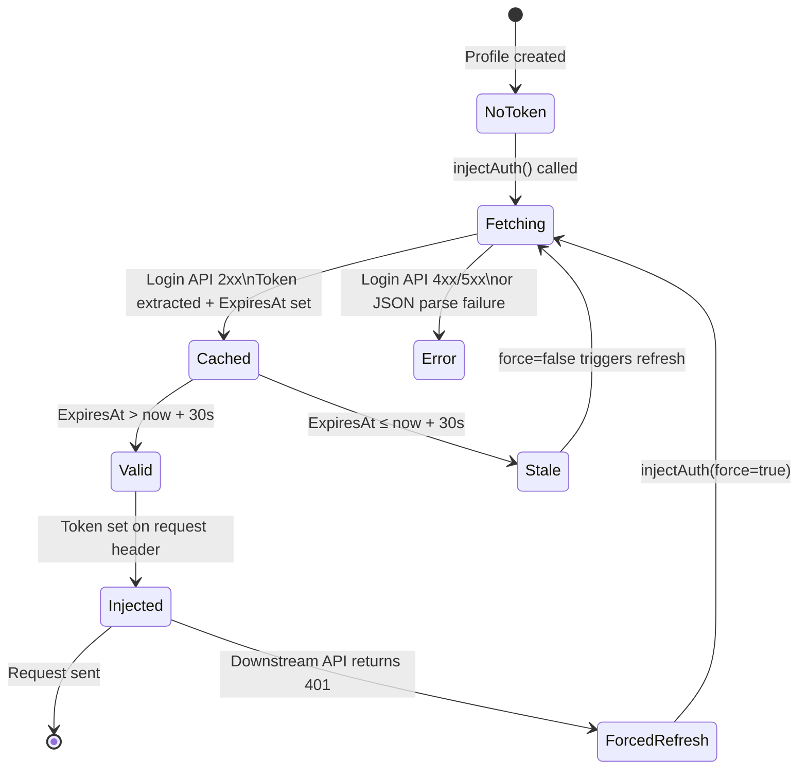
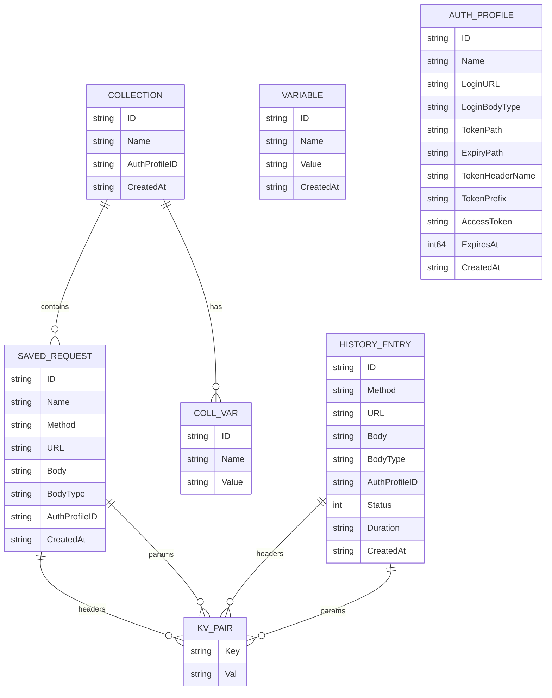

# Architecture

API Playground is a native macOS desktop application built from a Go backend server and an HTMX/DaisyUI frontend, packaged into a standard `.app` bundle via `webview_go` (WKWebView).

## High-level component map

## Runtime startup sequence

## Request proxy flow (POST /send)

## Variable expansion architecture

## Auth profile token lifecycle

## Data model relationships

## Template rendering model

All HTML is server-side rendered via Go's `html/template` package through Gin. HTMX drives partial page updates by swapping targeted DOM fragments — there is no client-side routing or virtual DOM.

| Trigger | Endpoint | Target element | Swap mode |
|---|---|---|---|
| Page load | `GET /` | Full page | Full page |
| HTMX `hx-trigger="load"` | `GET /history-panel` | `#history-list-container` | `innerHTML` |
| HTMX `hx-trigger="load"` | `GET /collections-panel` | `#collections-list` | `innerHTML` |
| HTMX `hx-trigger="load"` | `GET /auth-profiles/options` | `#auth-select` | `innerHTML` |
| HTMX `hx-trigger="load"` | `GET /collections/options` | `#save-collection-select` | `innerHTML` |
| Send button click | `POST /send` | `#response-body` | `innerHTML` |
| History entry click | `GET /history/:id` | `#request-form` | `outerHTML` |
| Collection request click | `GET /collections/:id/requests/:req_id` | `#request-form` | `outerHTML` |
| Import modal submit | `POST /parse-curl` or `/parse-raw-http` | `#request-form` | `outerHTML` |
| `historyUpdated` event | `GET /history-panel` | `#history-list-container` | `innerHTML` |
| `collectionsUpdated` event | `GET /collections-panel` | `#collections-list` | `innerHTML` |

Custom `HX-Trigger` response headers (e.g. `historyUpdated`, `collectionsUpdated`, `variablesUpdated`, `authProfilesUpdated`) propagate state changes to listening elements without requiring the caller to know which panels need refreshing.

## File locations at runtime

| Mode | Data directory |
|---|---|
| `.app` bundle | `~/Library/Application Support/APIPlayground/` |
| Terminal (`go run .` or binary) | Current working directory |

The launcher script handles the `.app` case by `cd`-ing to the data directory before `exec`-ing the binary. The binary always reads/writes JSON files relative to its current working directory.

## Key design constraints

- **CGO required**: `screen_darwin.go` uses CGO to call CoreGraphics `CGDisplayBounds`. The build must use `CGO_ENABLED=1`.
- **macOS only**: `webview_go` uses WKWebView, which is macOS/iOS-only. The binary will not run on other platforms.
- **Port 8080 hardcoded**: The local server always binds to `:8080`. Running two instances simultaneously will fail with "address already in use".
- **No auth header exposure**: Auth token injection happens entirely server-side (`injectAuth`). The browser never sees the raw token value.
- **50 KB response cap**: Response bodies are truncated at 50,000 characters before rendering to prevent the WKWebView from locking up on large payloads.
