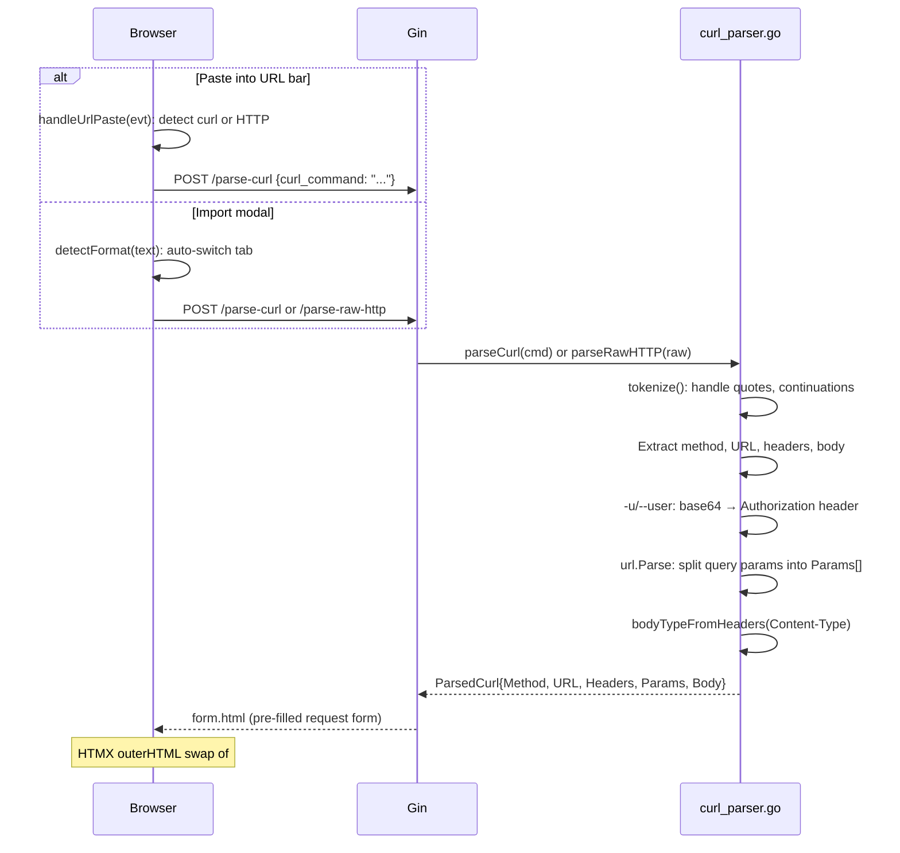
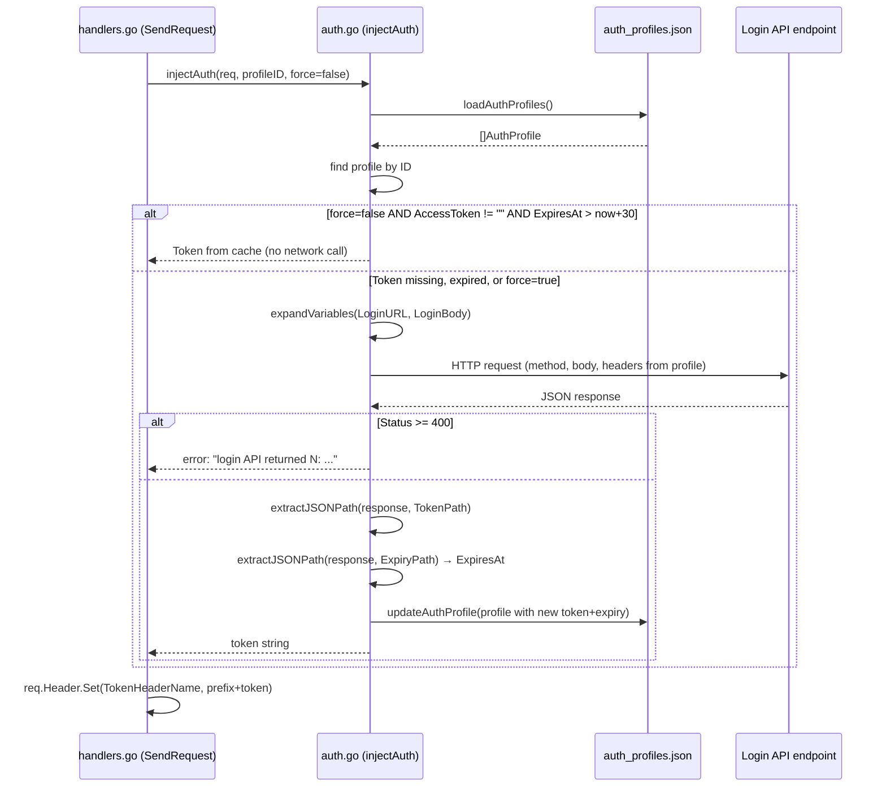
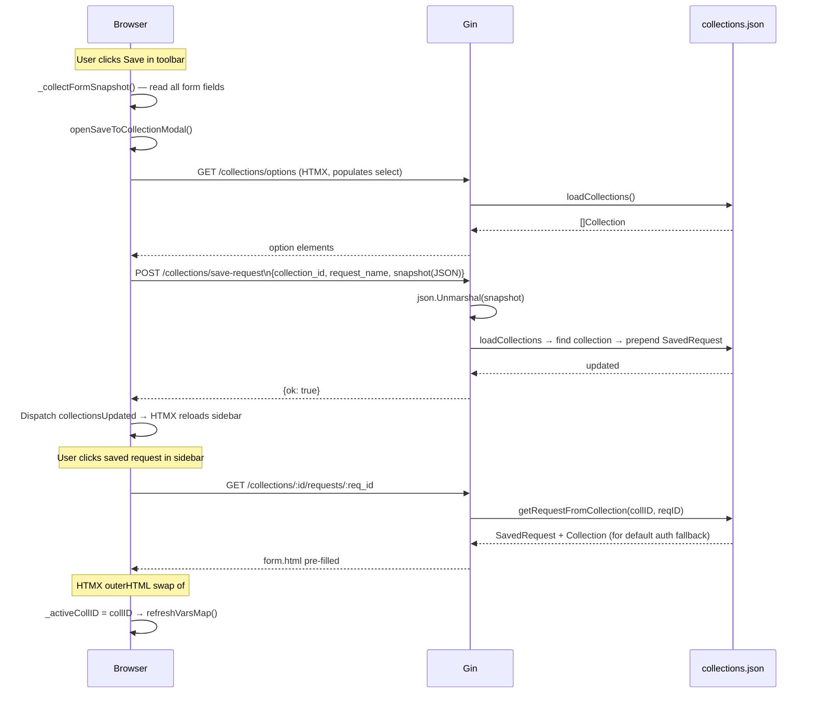
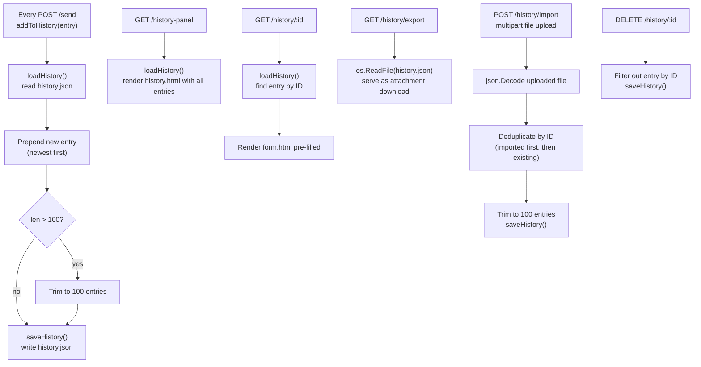
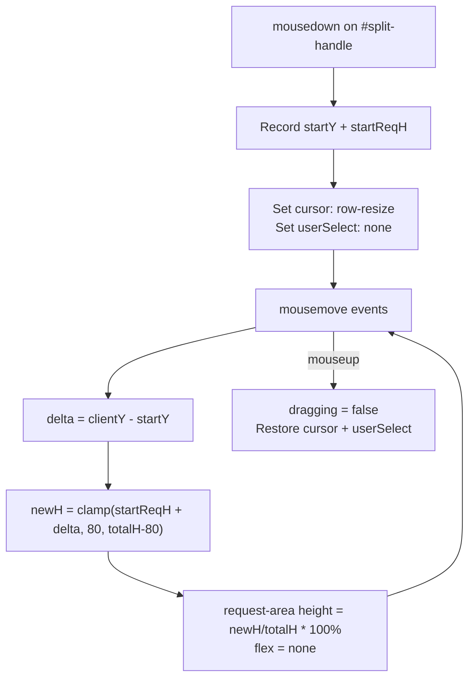

# Data Flow

This document describes how data moves through API Playground for every major user action.

## 1. Sending an HTTP request

```mermaid
sequenceDiagram
    participant UI as Browser (WKWebView)
    participant GIN as Gin /send handler
    participant VARS as Variable expander
    participant AUTH as Auth injector
    participant EXT as External API

    UI->>GIN: POST /send (form fields)
    Note over UI,GIN: method, url, body, body_type,\nheader_key[], header_val[],\nparam_key[], param_val[],\nauth_profile_id, collection_id

    GIN->>VARS: expandVariablesCtx(url, collectionID)
    VARS->>VARS: buildVarMap: load globals + collection vars
    VARS-->>GIN: expanded url

    GIN->>VARS: expandVariablesCtx(body, ...)
    VARS-->>GIN: expanded body

    GIN->>VARS: expandVariablesCtx(each header val, ...)
    VARS-->>GIN: expanded header values

    GIN->>GIN: Inherit collection default auth if none set
    GIN->>GIN: Validate URL; auto-prefix https://
    GIN->>GIN: Check for unresolved {{PLACEHOLDER}}
    GIN->>GIN: Append query params to URL

    GIN->>AUTH: injectAuth(req, profileID, force=false)
    AUTH->>AUTH: getAuthProfile(profileID)
    AUTH->>AUTH: Check cached token validity (ExpiresAt > now+30s)
    alt Token expired or missing
        AUTH->>EXT: POST login URL (credentials)
        EXT-->>AUTH: JSON with token
        AUTH->>AUTH: extractJSONPath(token_path)
        AUTH->>AUTH: Update ExpiresAt, write auth_profiles.json
    end
    AUTH-->>GIN: token set on Authorization header

    GIN->>EXT: Proxied HTTP request (30s timeout)
    EXT-->>GIN: Response

    alt Response is 401 and auth profile set
        GIN->>AUTH: injectAuth(req, profileID, force=true)
        AUTH->>EXT: POST login URL (force refresh)
        EXT-->>AUTH: Fresh token
        AUTH-->>GIN: new token on header
        GIN->>EXT: Retry request
        EXT-->>GIN: Response
    end

    GIN->>GIN: Read body, pretty-print JSON, truncate > 50KB
    GIN->>GIN: addToHistory(entry) → history.json
    GIN-->>UI: response.html HTML snippet
    Note over UI: HTMX swaps into #response-body
    UI->>UI: Dispatch HX-Trigger: historyUpdated
    UI->>GIN: GET /history-panel
    GIN-->>UI: history.html snippet
```

## 2. curl / raw HTTP import



## 3. Variable resolution

```mermaid
flowchart TD
    subgraph Client["Client-side (live preview only)"]
        A["URL input: oninput"] --> B["updateVarPreview()"]
        B --> C["expandVarsPreview() — regex over _varsMap"]
        C --> D["Show #url-var-preview span"]

        E["Type {{ in any field"] --> F["_checkVarTrigger()"]
        F --> G["Filter _varsMap names by prefix"]
        G --> H["_showVarAC() floating picker"]
        H --> I["User selects → _pickVarAC()"]
        I --> J["Insert {{NAME}} at cursor"]
    end

    subgraph Server["Server-side (authoritative)"]
        K["POST /send"] --> L["buildVarMap(collectionID)"]
        L --> M["Load variables.json\n(globals)"]
        L --> N{"collectionID?"}
        N -- "yes" --> O["Load collections.json\nfind matching collection vars"]
        O --> P["Merge: coll overrides global"]
        N -- "no" --> P
        M --> P
        P --> Q["varRe: replace {{NAME}}"]
        Q --> R["varReSingle: replace {NAME}\n(only if name exists in map)"]
        R --> S["Expanded value"]
    end

    subgraph Panel["Right sidebar refresh"]
        T["variablesUpdated or collectionsUpdated event"] --> U["refreshVarsMap()"]
        U --> V["GET /variables/map?collection_id=..."]
        U --> W["GET /variables/list"]
        U --> X{"activeCollID set?"}
        X -- "yes" --> Y["GET /collections/:id/variables"]
        Y --> Z["updateVarsPanel()"]
        V --> Z
        W --> Z
    end
```



## 4. Auth token acquisition and injection



## 5. Collection request save / load



## 6. History persistence



## 7. Panel resize drag



## 8. HTMX event bus

HTMX custom events are used as a lightweight pub/sub system so that server responses can trigger UI refreshes across independent panel elements without point-to-point coupling.

```mermaid
flowchart TD
    subgraph Producers["Server response headers (HX-Trigger)"]
        P1["POST /send → historyUpdated"]
        P2["DELETE /history/:id → historyUpdated"]
        P3["POST /history/import → historyUpdated"]
        P4["POST /collections → collectionsUpdated"]
        P5["DELETE /collections/:id → collectionsUpdated"]
        P6["POST /collections/save-request → collectionsUpdated"]
        P7["POST /collections/:id/settings → collectionsUpdated"]
        P8["PATCH /collections/:id/variables/:var_id → collectionsUpdated"]
        P9["POST /variables → variablesUpdated"]
        P10["PATCH /variables/:id → variablesUpdated"]
        P11["DELETE /variables/:id → variablesUpdated"]
        P12["POST /auth-profiles → authProfilesUpdated"]
        P13["DELETE /auth-profiles/:id → authProfilesUpdated"]
    end

    subgraph Consumers["Elements listening on body (hx-trigger or addEventListener)"]
        C1["#history-list-container\nhx-trigger='historyUpdated from:body'\n→ GET /history-panel"]
        C2["#collections-list\nhx-trigger='collectionsUpdated from:body'\n→ GET /collections-panel"]
        C3["#vars-modal-content\nhx-trigger='variablesUpdated from:body'\n→ GET /variables"]
        C4["#auth-modal-content\nhx-trigger='authProfilesUpdated from:body'\n→ GET /auth-profiles"]
        C5["JS: body.addEventListener('variablesUpdated')\n→ refreshVarsMap()"]
        C6["JS: body.addEventListener('collectionsUpdated')\n→ refreshVarsMap()"]
    end

    P1 --> C1
    P2 --> C1
    P3 --> C1
    P4 --> C2
    P5 --> C2
    P6 --> C2
    P7 --> C2
    P8 --> C2
    P9 --> C3
    P9 --> C5
    P10 --> C3
    P10 --> C5
    P11 --> C3
    P11 --> C5
    P12 --> C4
    P13 --> C4
    P4 --> C6
    P5 --> C6
    P6 --> C6
```


